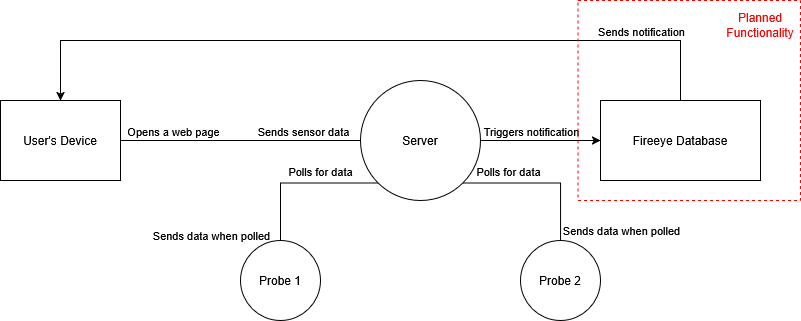
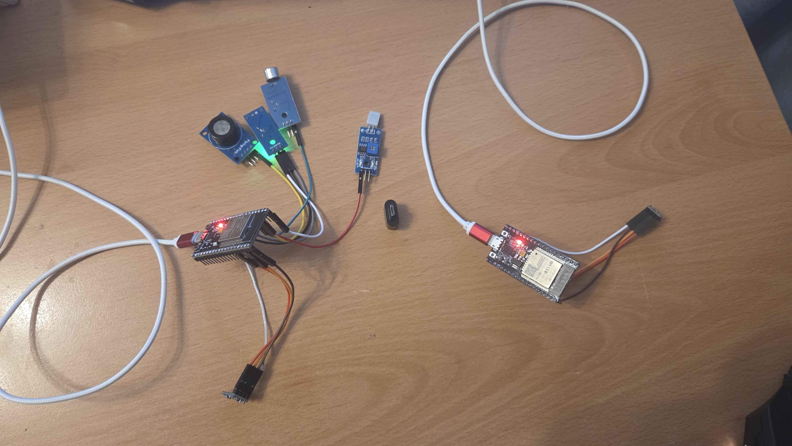
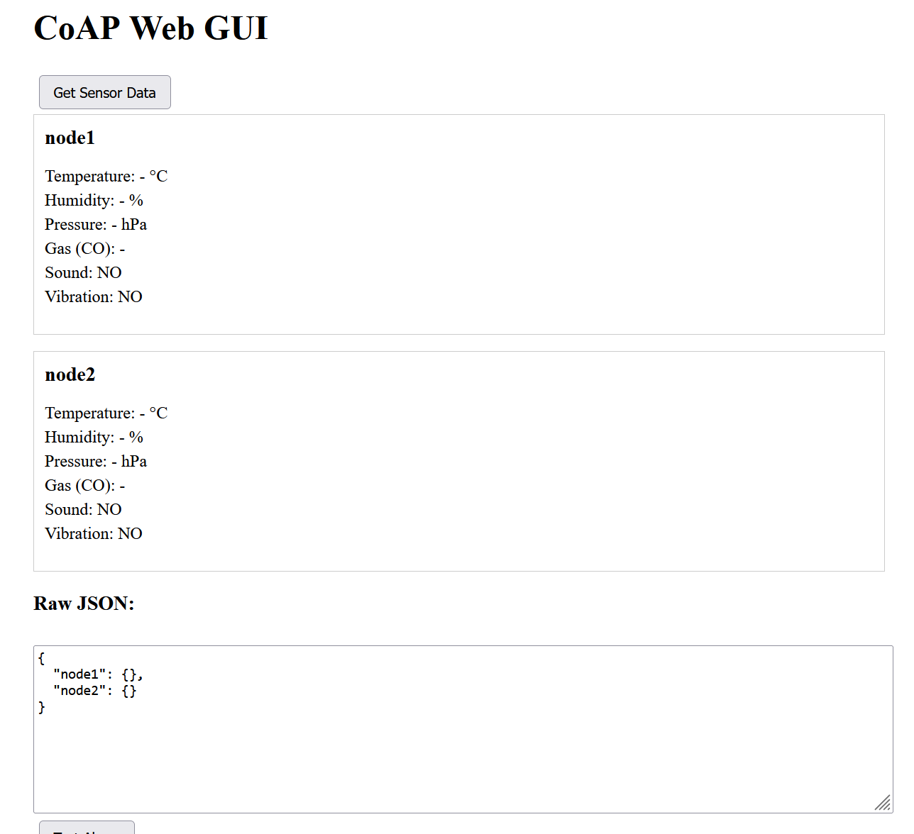
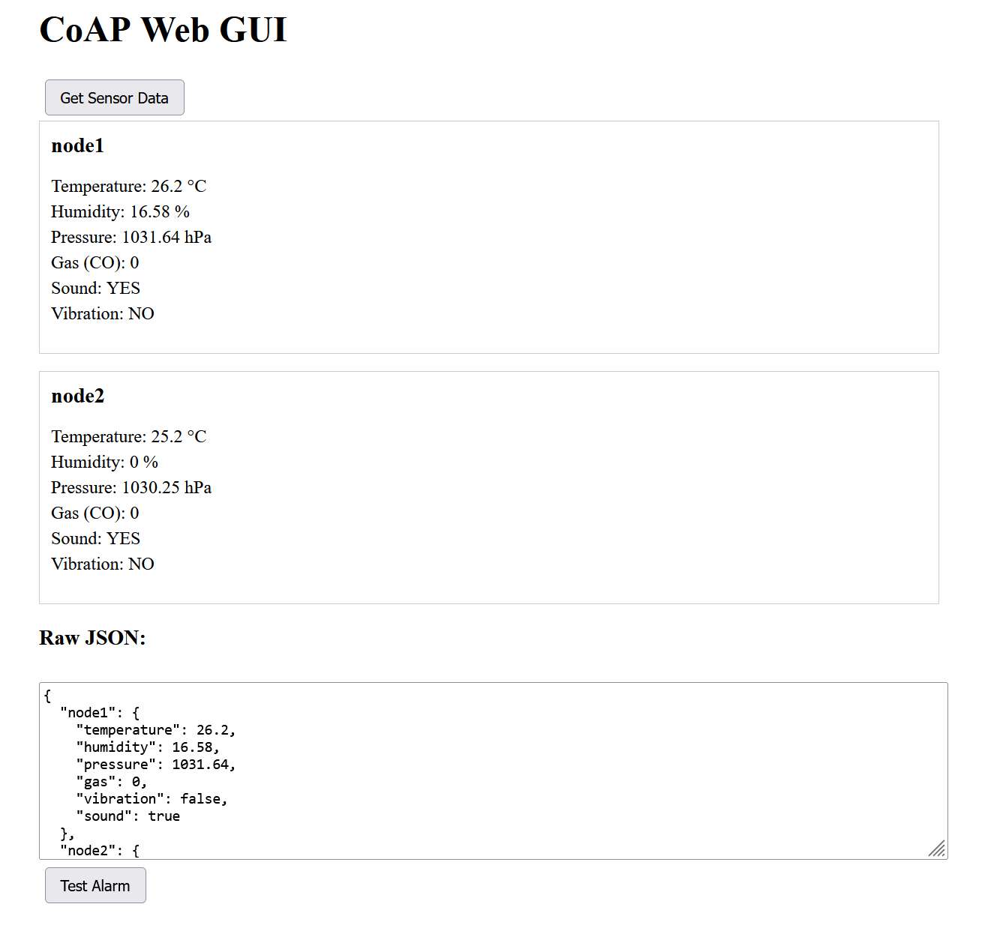

# IOT_project-Environment-Safety-Monitor

Vlad-Mihail TEODOROIU

Reads environmental data (ex: air pressure, gas presence, vibration, ambient noise) and sends it to a web page for viewing. If it detects abnormalities (ex: gas leak, earthquake, "booms") it sends a notification to the user's phone.

---
## Intro

We will be using two detector-probe-devices, to showcase the ability to gather data from multiple locations and for the end user to be able to identify where the warning is coming from.
As such, we need to be able to:
- have devices that are able to stay operational for extensive periods of time
- record relevant data
- send the relevant data to a central "hub"
- communicate with the user's device to display data and warn them about anomalous activities

Device staying operational, two options:
- be plugged in
- battery

What we will need to monitor:
- temperature
- humidity
- pressure
- air quality
- movement
- sound

---

## Hardware

For the nodes / detector probes, we will need an ESP32 board, and then the detectors.
We will be using the following detectors:
- BMP180: temperature and pressure
- HR202: humidity
- MQ-7: air quality, specifically carbon monoxide
- 0104110000000347: movement
- 0104110000082152: sound

Connected to the board as such:

**Figure 1:** Diagram of sensors connected to the board

| # | Component                         | Model                        | Quantity | Notes |
|---|-----------------------------------|------------------------------|----------|-------|
| 1 | Microcontroller                   | Esp-32s v1.1 101010          | 2        | Probe center |
| 2 | Temperature & Pressure Sensor     | BMP180                       | 2        | SDA & SCL |
| 3 | Humidity Sensor                   | HR202                        | 2        | Digital output |
| 4 | CO Detector                       | MQ-7                         | 2        | Analog output |
| 4 | Movement Detector                 | 0104110000000347             | 2        | Digital output |
| 4 | Sound Detector                    | 0104110000082152             | 2        | Analog output |
| 5 | Cables                            | Mico-USB                     | 2        | Programming & Power supply|
| 7 | Wires                             | Female-Female                | ~10      | Connections |

---

## Software

The software is organized in a distributed architecture consisting of sensor nodes and a central server.

The server would have then been supposed to use a fireeye database to notify the user.

**Figure 2:** The web app with independent data

### Sensor Nodes (ESP32)

Each ESP32 acts as an independent CoAP server exposing the sensor values:

- /sensors/temperature
- /sensors/humidity
- /sensors/pressure
- /sensors/gas
- /sensors/vibration
- /sensors/sound

The node firmware is structured into:

- sensors.* – sensor drivers and data acquisition
- net.* – Wi-Fi initialization and CoAP server logic
- config.h – network credentials and configuration

Sensor values are read on demand and returned as plain-text CoAP responses.

### Central Server

A Node.js server acts as a CoAP client for multiple sensor nodes and as an HTTP server for the web interface.

- Periodically polls each node independently
- Stores the latest known values per node
- Continues operating even if one node becomes unreachable
- Sends Web Push notifications when readings exceed thresholds (e.g., high CO, vibration, temperature anomalies). Notifications work while the browser is open on a desktop or mobile device.

### Web Interface

A simple HTML/JavaScript dashboard (index.html) displays:

- Live sensor values for each node
- Automatic refresh at fixed intervals
- Raw JSON output for debugging
- The web UI is accessible from both desktop and mobile devices on the same network.

### Messaging

Alerts are triggered only while the web page is open, using Web Push.

---

### Testing and Results

**Figure 4:** The two nodes, the primary one has all the sensors, the second only the BME one

**Figure 5:** The web app without any data

**Figure 6:** The web app with independent data

**Figure 7:** Video of the two probes sending data to the server
